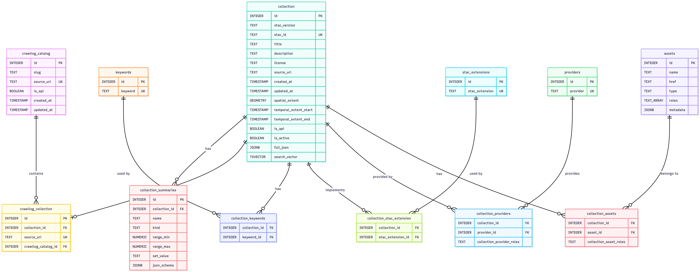

# STAC-Atlas Database

This component contains the PostgreSQL database setup for STAC-Atlas – a system for managing and searching STAC (SpatioTemporal Asset Catalog) Collections.

## Overview

The database is built on **PostgreSQL 16** with **PostGIS 3.4** for spatial queries. It stores STAC Collections and their metadata with full-text search and spatial indexing.

## Database Structure

### Entity-Relationship Diagram



### Tables

#### Crawler Tracking

| Table | Description |
|-------|-------------|
| `crawllog_catalog` | Tracks crawler progress for catalogs. Enables resume after crash. |
| `crawllog_collection` | Tracks crawl status of individual collections with reference to catalog. |

The `crawllog_catalog` table also serves as a mirror of the STAC index and is used for generating STAC IDs.


#### Collections

| Table | Description |
|-------|-------------|
| `collection` | Main metadata of STAC Collections (title, description, spatial/temporal extent, license). Stores complete JSON representation in `full_json`. |
| `collection_summaries` | Statistical summaries (value ranges, sets) for collection properties. |

#### Lookup Tables

| Table | Description |
|-------|-------------|
| `keywords` | Reusable keywords for search. |
| `stac_extensions` | STAC extensions (e.g., EO, SAR, Point Cloud). |
| `providers` | Data providers and organizations. |
| `assets` | Downloadable resources (files, thumbnails, metadata). |

#### Junction Tables (n:n)

| Table | Description |
|-------|-------------|
| `collection_keywords` | Links collections to keywords. |
| `collection_stac_extension` | Links collections to STAC extensions. |
| `collection_providers` | Links collections to providers incl. roles. |
| `collection_assets` | Links collections to assets incl. roles. |

### Extensions

- **PostGIS**: Spatial data types and functions (geometries, bounding boxes)
- **pg_trgm**: Trigram-based text search for fuzzy matching

### Indexes

Optimized indexes for fast queries:

| Type | Usage |
|------|-------|
| **B-Tree** | Title, timestamps, provider names |
| **GIN** | Full-text search (`search_vector`), JSONB fields, asset roles |
| **GIST** | Spatial extent (`spatial_extent`) |

### Triggers

- **`collection_search_vector_update`**: Automatically updates the search vector when collections are modified
- **`collection_keywords_update_vector`**: Updates the search vector when keywords are added/removed

## Quick Start

### Start the Database

```bash
cd ./db/
cp example.env .env
# Fill in passwords in .env file
docker-compose up
```

### Connection Details

| Parameter | Value |
|-----------|-------|
| Host | choose your server |
| Port | Configurable via `DB_PORT` in `.env` |
| Database | Configurable via `POSTGRES_DB` in `.env` |

## Configuration

### Environment Variables (.env)

| Variable | Description |
|----------|-------------|
| `POSTGRES_DB` | Database name |
| `POSTGRES_USER` | Admin user (superuser) |
| `POSTGRES_PASSWORD` | Admin password |
| `DB_PORT` | External port (host side) |
| `STAC_API_PASSWORD` | Password for API user (read-only access) |
| `STAC_CRAWLER_PASSWORD` | Password for crawler user (read-write access) |

**Important**: Edit the `.env` file, not the `docker-compose.yml`. A template is provided in `example.env`.

### User Roles

| User | Permissions |
|------|-------------|
| `stac_api` | Read-only access (SELECT) – for the API |
| `stac_crawler` | Full read-write access – for the crawler |

## Initialization Scripts

All scripts in the `./init/` folder are automatically executed on first start in numerical order:

| Script | Description |
|--------|-------------|
| `00_users.sh` | Creates users (`stac_api`, `stac_crawler`) with appropriate permissions |
| `01_extensions.sql` | Installs PostGIS and pg_trgm extensions |
| `02_tables_catalog.sql` | Creates `crawllog_catalog` for crawler tracking |
| `03_tables_collections.sql` | Creates collection tables and lookup tables |
| `04_relation_tables.sql` | Creates junction tables (n:n relationships) |
| `05_indexes.sql` | Creates performance indexes |
| `06_triggers.sql` | Creates triggers for full-text search |

## Migrations

The `./migrations/` folder contains SQL scripts for schema changes after initial setup. Those are not planed yet, but could be used in the future, when chages to the given database are required.

